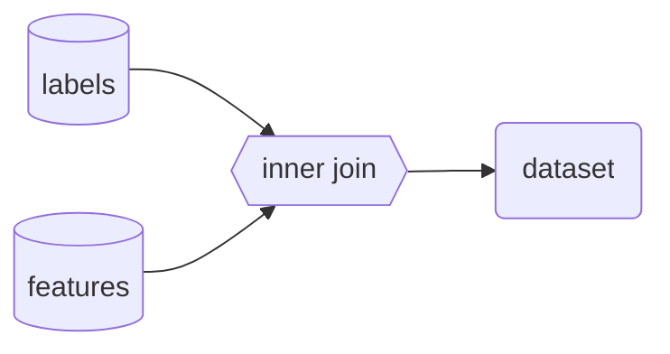

# Model

## Mathematical Model
Formulate the [central question](context.md#central-question) problem as a machine learning problem.

$$
y_i = f(\vec{x}_i)
$$

## Data Model
Describe how the dataset will be constructed.

Show an example of the dataset.

|label|feature_0|feature_1|...|feature_n|
|-|-|-|-|-|
|False|1|"red"|...|0.73|
|True|0|"green"|...|0.42|
